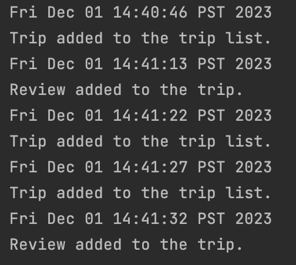

# My Personal Project - Travel Planner

**PROPOSAL**

- The application will be a travel planner where you can create different trips, such as a Europe trip, trip to the
tropical islands, etc. You will be able to add different details and information to the trip such as destinations,
hotels, flights, dates. The main focus will be on creating a planner where all travel information is easily accessible 
to view and compare different trips and the experiences. The main target audience will be on people who travel a lot
like for work or to visit family, or just a simple vacation. This project is of interest to me because I love
travelling and I want to make it easier for people to plan their trips and relax on their vacation. The user will be
able to create multiple different trips and itineraries, and view a couple preset vacations if they're looking for some
inspiration on where to go. After the trip, they'll be able to write a review on their experience and store it so that
in the future they can see their notes when planning their next trip. For example the review could be "Don't forget to 
pack a winter jacket when visiting New York in the fall, as it can get icy but overall great experience. Budget
a little more than you usually would as it is an expensive city."

## User Stories
- As a user, I want to be able to add a trip to a list, and add its details such as flight options, number of days,
hotels and destinations.
- As a user, I want to be able to view my list of trips, and its different information in order to make it easy to see
the different trip options and compare itineraries.
- As a user, I want to be able to view a few presets of trips in order to get some inspiration for my vacation, and
take the preset and have the option to add it to my trip list.
- As a user, I want to be able to select a trip, and create a post-travel review and save the review with my trip, so I
can see it at a later date.
- As a user, I want to be able to save my list of trips to file (if I so choose)
- As a user, I want to be able to load my list of trips from file (if I so choose)

## Instructions for Grader

- You can generate the first required action related to the user story "adding multiple Xs to a Y" by clicking the add
trip button at the top left of the GUI. Then input your information in the text boxes where the trip length is an
integer. Press OK to view the trips.
- You can generate the second required action related to the user story "adding multiple Xs to a Y" by clicking the add
review button at the top of the GUI. Then you will be prompted to select the trip that you wish to add a review to with
a dropdown menu. After selecting the trip, press OK. Next, type your review and press OK.
- You can locate my visual component by clicking the add trip button at the top left of the GUI. You will see a picture
of a relaxing scene at the beach.
- You can save the state of my application by pressing the save button at the top of the GUI. It will say if it has
been saved successfully.
- You can reload the state of my application by pressing the load button at the top of the GUI. It will display your
saved trips.

## Phase 4: Task 2

## Phase 4: Task 3

- I would first of all refactor the main class, so it is not dependent on the console and GUI classes, as well as the
Event and EventLog classes. This would make it so that main simply runs the program and doesn't perform things such as
constructing and printing the actions in the console. I would also try to refactor the GUI class, so it is not
associated with the console class, as this made it difficult in drawing the UML diagram. If I commented out the console
class, my GUI class would not work properly, and that is a design problem as my console class is not functioning
anymore anyway.
- The main thing that I could do to improve the design of my project would be to separate my methods into more classes
to follow the single responsibility principle. Currently, the UI classes especially have a bunch of different
functionalities that are merged into one class, and it makes it difficult to find specific methods that I am trying to
fix or add to. In the future, I will definitely split up my classes and follow the single responsibility principle more.